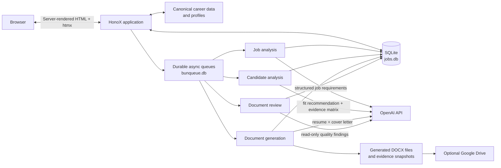

# Job Application Tracker

A local-first, server-rendered job pipeline built with Bun, HonoX, htmx, Drizzle ORM, SQLite, Tailwind CSS, and daisyUI. It has no client-side React or Preact hydration runtime.

## Data flow



The application persists each requested operation as an append-only run in SQLite before queuing it. In production, all four named queues use embedded Bunqueue and durable state in `QUEUE_FILE_NAME` (normally `/data/bunqueue.db`); at startup the application recovers queued runs. In development, the same jobs run in-process without Bunqueue persistence. The browser never waits for a model response: it polls the persisted run state through htmx. A generated document is a draft, not an approved application artifact: the user reviews it and decides whether to download or upload it.

## Career data setup

The repository ships with `career-data.example/` and `profiles.example/`: a small, valid dataset that lets a fresh clone start and run tests. To generate your own documents, initialize the runtime directories from those examples and replace the placeholders with accurate, interview-defensible facts:

```sh
cp -R career-data.example career-data
cp -R profiles.example profiles
```

Keep stable IDs when editing. Profiles select and order facts by ID; they should not duplicate the underlying experience, achievement, project, or skill records. The runtime uses `career-data/` and `profiles/` when present, and falls back to the examples otherwise.

For a deployed Fly instance, persist these directories on the mounted `/data` volume, then set `CAREER_DATA_DIR=/data/career-data` and `CAREER_PROFILES_DIR=/data/profiles`.

### Approved Base Resumes

An approved Base Resume is a private Markdown file that serves as an editorial starting point for drafting, while canonical Career Data remains the factual authority. They live at `career-data/base-resumes/<direction>.md` with a private `manifest.json` that records each direction's version label, approval date, and normalized-text SHA-256 hash.

```sh
# Import a PDF, Markdown, or text file as the approved Base Resume for a direction.
# PDF extraction uses Ghostscript locally; production never extracts PDFs.
bun run resume:import -- --direction fhir --input ~/resumes/fhir.pdf --version v1
```

The import CLI validates that the direction matches an existing profile and refuses empty files. It writes the normalized Markdown and updates `manifest.json` in one step. Missing a Base Resume disables document generation only for that direction — the app never falls back to a blank resume.

The production app reads the approved Markdown directly. Set `CAREER_BASE_RESUMES_DIR` to relocate the directory; it defaults to `CAREER_DATA_DIR/base-resumes`. The Base Resume Markdown and manifest travel with the private career-data bundle, so `bun run fly:sync-career-data` uploads them to `/data/career-data/base-resumes` alongside the fact JSON files.

## Run locally

```sh
bun install
bun run setup     # runs migrations, synchronizes the taxonomy, then career skills
bun run dev
```

`bun run setup` is equivalent to `bun run db:migrate && bun run taxonomy:sync --apply && bun run skills:sync --apply`. You can also run `bun run db:migrate` alone and skip the career skill sync until your `career-data/` is mounted.

The SQLite database is created as `jobs.db`. Set `DB_FILE_NAME` to use a different file.

## Career skill taxonomy and sync

`career-data/skills.json` is the source of truth for the skills you actually possess. `career-data/skill-taxonomy.json` defines that candidate's allowed category keys, labels, and display order. Keeping both files in the same private career-data bundle lets different users adopt different taxonomies without changing application source code. SQLite mirrors the selected taxonomy in `skill_categories` so operational skills can reference it safely. The application does not provide category-management UI in this stage.

```sh
bun run skills:audit        # read-only review of duplicates, aliases, and non-skills
bun run taxonomy:sync       # dry-run default taxonomy synchronization
bun run taxonomy:sync --apply # upsert JSON-owned key, label, and sort order
bun run skills:sync         # dry-run preview (default)
bun run skills:sync --apply # write inside a transaction
bun run skills:sync --check # non-zero exit when conflicts require manual review
```

- Each career skill must use a stable lowercase kebab-case `id`, declare a `category` from the adjacent `career-data/skill-taxonomy.json`, and may list aliases. That ID is copied directly to the immutable SQLite `skills.key`; labels and aliases are never used to guess identity.
- Job-post and manually discovered skills accumulate in SQLite. When a later career-data skill uses the same key, synchronization promotes that row to the canonical career skill. Alias collisions are reported and can be resolved explicitly with **Merge skill** on `/skills`.
- Taxonomy synchronization is idempotent. It upserts configured keys, labels, and sort order; categories no longer present in JSON are retained as orphaned database rows so historical skill records are not invalidated.
- Sync matches only the immutable career skill ID to `skills.key`. It updates an exact-key row or creates a new approved skill; labels and aliases never cause an automatic merge.
- Evidence, levels, last-used dates, review notes, and directions are never copied into the taxonomy tables.
- A missing optional `career-data/` directory can be skipped during startup with `bun run skills:sync --if-present`.

## Career data and document generation

`career-data/` is the canonical, factual source used to generate documents. Keep stable IDs in those files: profiles refer to the IDs rather than copying experience or skill details.

- `candidate.json`, `experiences.json`, `achievements.json`, `publications.json`, `projects.json`, `skills.json`, and `stories.json` hold reusable facts. `skill-taxonomy.json` defines the candidate-specific category vocabulary used by `skills.json`. Publications keep a display-ready citation and structured authors, including an `isCandidate` marker.
- `preferences.json` and `portfolio-content.json` remain canonical planning data.
- `profiles/<direction>.profile.json` contains only direction-specific selection and ordering rules. Its `id` must match its filename.

Every generation run records an immutable evidence-selection snapshot in the database and writes a matching JSON file beneath `ARTIFACTS_DIR/run-<id>/`. The workspace’s **Evidence selection & generation record** section shows the exact selected IDs and schema/prompt versions, and lets you download that snapshot. This makes a generated resume or letter reviewable even after career data changes.

Do not use the old `profiles/candidate.profile.json`, `CANDIDATE_PROFILE_FILE`, or `CANDIDATE_PROFILE_JSON` configuration: candidate facts now come only from `career-data/candidate.json`.

For Fly.io deployment, `fly.toml` mounts a persistent volume at `/data` and sets `DB_FILE_NAME=/data/jobs.db`. The machine is configured to stop when idle and start automatically on the next HTTP request. Create the volume once before deploying:

```sh
fly volumes create data --region yyz --size 1
fly deploy
```

Set `ARTIFACTS_DIR=/data/artifacts` and `QUEUE_FILE_NAME=/data/bunqueue.db` in Fly as well, so snapshots, generated documents, and queued work survive machine restarts.

The production start command runs Drizzle migrations before starting the server. Keep one Fly machine for this SQLite deployment because Fly volumes are attached to a single machine.

Fly production reads career data—including `skill-taxonomy.json`—from its persistent volume through `CAREER_DATA_DIR=/data/career-data` (and `CAREER_PROFILES_DIR=/data/profiles`). Upload the complete career-data directory rather than individual fact files, then synchronize it without copying private data into the image or Git:

```sh
fly ssh console
cd /app
bun run skills:sync --apply
```

Run `bun run taxonomy:sync --apply` before career skill sync whenever the JSON taxonomy changes. Use `bun run skills:sync --if-present` in startup scripts when career data may not be mounted yet; it exits cleanly instead of raising a runtime error, and startup never writes to the Git-tracked example data.

To update the private career-data bundle on an existing Fly volume, use the repository CLI. With no selection it uploads every JSON file in both `career-data/` and `profiles/`; selected paths update only those files. Each file is uploaded to a unique temporary path and then moved over the destination, because Fly SFTP deliberately refuses to overwrite existing files. Uploading never deletes extra remote files.

```sh
bun run fly:sync-career-data
bun run fly:sync-career-data -- career-data/skills.json
bun run fly:sync-career-data -- profiles/fhir.profile.json
bun run fly:sync-career-data -- career-data profiles
bun run fly:sync-career-data -- --sync-db career-data/skills.json
```

The Fly app defaults to `FLY_APP_NAME` and then the `app` value in `fly.toml`. For a single-Machine app, the CLI resolves and starts that Machine before each transfer so Fly auto-stop cannot interrupt a long sync. Use `--app <name>` to override the app; an app with multiple Machines requires `--machine <id>` so every file reaches the same volume. `--sync-db` runs the production taxonomy and career-skill synchronization through `sh -lc` after all uploads succeed. The command requires an authenticated `fly` CLI and an existing `/data` volume.

## How to use the tracker

1. In **Applications**, paste a posting and use **Parse with AI**, or enter the known facts directly in Quick collect.
2. Review the draft. Add the job URL, source, company, and direction yourself, then save it as **Saved**.
3. Move a role to **Apply Today** when it becomes a task. Complete the application workspace and select **Sent application** after applying.
4. Record follow-ups and interviews in the workspace. These activities advance the visible pipeline without overwriting a more advanced status.
5. In **Review**, confirm the recommended profile and resolve every missing skill: **Skip**, or **Include** with a truthful, application-specific reason. This creates the evidence selection used for generation.
6. In **Documents**, explicitly generate the resume and cover letter. Review the frozen evidence snapshot and DOCX files; optionally request a semantic document review. A generated file is a draft until you decide it is suitable to use.
7. Download approved documents or upload them to Google Drive when it is connected. Existing artifacts and Drive links remain available if a newer run later becomes outdated.
8. Manage reusable companies, contacts, and skills from their dedicated pages under Career and Network. Export JSON periodically as a backup.

### Configuration

Copy `.env.example` to `.env` for local development. `OPENAI_API_KEY` is needed only for AI parsing, analysis, and document generation. Google OAuth variables are needed only for optional Drive uploads. `CAREER_DATA_DIR` and `CAREER_PROFILES_DIR` optionally point to the runtime fact directories; local defaults are `career-data` and `profiles`. The skill taxonomy is always loaded from `skill-taxonomy.json` inside `CAREER_DATA_DIR`. Each specialized model variable (`OPENAI_MODEL_JOB_PARSER`, `OPENAI_MODEL_CANDIDATE_FIT`, `OPENAI_MODEL_RESUME`, `OPENAI_MODEL_COVER_LETTER`, `OPENAI_MODEL_DOCUMENT_REVIEW`) falls back to `OPENAI_MODEL_DEFAULT`.

### Private deployment authentication

Fly deployment is fail-closed because `fly.toml` sets `APP_AUTH_REQUIRED=true`. Before deploying, generate a password, display it once, save it in a password manager, and set both credentials as Fly secrets:

```sh
APP_AUTH_PASSWORD="$(openssl rand -base64 32)"
printf 'Job Tracker password: %s\n' "$APP_AUTH_PASSWORD"
fly secrets set --app job-hunting \
  APP_AUTH_USERNAME='fred' \
  APP_AUTH_PASSWORD="$APP_AUTH_PASSWORD"
unset APP_AUTH_PASSWORD
```

The browser presents its native Basic Auth prompt. Without both secrets, production returns `503` instead of exposing the application. Local development remains open while `APP_AUTH_REQUIRED=false`; set the username and password in the ignored `.env` file when local authentication testing is needed. Every application route also uses same-origin CSRF validation, security headers, and `Cache-Control: no-store`.

### GitHub Actions deployment

The workflow in `.github/workflows/ci-cd.yml` runs formatting, typechecking, tests, and a production build for pull requests and pushes to `main`. It does not deploy automatically. To deploy, open **Actions**, select **CI and Fly Deploy**, choose **Run workflow** from `main`, and run it after CI passes. Add a repository secret named `FLY_API_TOKEN` before the first manual deployment.

### VS Code Remote / WSL

The dev server listens on all interfaces at port `5173`. If `http://localhost:5173` is not reachable from your browser, open the VS Code **Ports** panel and forward port `5173`; VS Code will provide the correct localhost URL. You can also use the Network URL printed by Vite (for example, `http://172.17.x.x:5173/`).

## Skill review, scores, and generation readiness

- A parsed job post produces structured skill requirements, each with a canonical name, category, importance, source excerpt, and confidence.
- Requirements resolve against the SQLite taxonomy: proven matches reuse career skills; unknown concepts become pending skills only when the opportunity is saved.
- The application workspace has a **Review** tab. Every `not-in-career-data` skill must be skipped or included with a reason before document generation is enabled.
- Dual scores are shown: **canonical match** (proven matches only) and **application coverage** (proven matches plus user-confirmed includes). Skipped and pending requirements count as uncovered.
- An include is application-only: it never changes career data or the canonical score, and its mandatory reason is the only allowed claim in generated documents.

## LLM workflow and boundaries

The pipeline makes four distinct model calls, each with a separate trust boundary. Every prompt, response schema, and frozen input records a version, and every run records the selected model in SQLite.

1. **Job-only analysis** (`OPENAI_MODEL_JOB_PARSER`) — receives only the raw job posting and the skill taxonomy. It never sees a resume, career data, profile contents, or candidate identity, and it never produces a fit score or a profile recommendation.
2. **Candidate fit / evidence matrix** (`OPENAI_MODEL_CANDIDATE_FIT`) — an explicit, queued paid action. It receives a frozen canonical input snapshot (career data, profiles, and the reviewed job requirements) and returns a labelled `apply`/`apply-selectively`/`skip` recommendation, a profile recommendation, and a requirement-to-evidence matrix. Every evidence reference must resolve to a supplied canonical ID.
3. **Resume and cover-letter generation** (`OPENAI_MODEL_RESUME`, `OPENAI_MODEL_COVER_LETTER`) — runs only from a frozen, validated evidence snapshot v2 and stores claim-level provenance so every material claim traces to a canonical or application-only source.
4. **Optional semantic document review** (`OPENAI_MODEL_DOCUMENT_REVIEW`) — an explicit paid action that observes and reports findings (`blocking`/`important`/`optional`). It never rewrites documents and its findings never become career facts.

Actions that incur a model call: parsing a job post, running candidate analysis, generating application documents, and requesting a semantic review. Saving an opportunity, confirming a profile, resolving a skill decision, and the deterministic keyword audit do **not** call a model.

### Versioned analysis, reruns, and freshness

Job Analysis, Candidate Analysis, and Documents are each append-only run histories in SQLite. Reruns never overwrite history; every run records its frozen input hash and, on completion, its result. "Stale" is always derived by comparing the current inputs against a run's frozen input — it is never a persisted status.

- **Job Analysis** staleness is driven by the raw posting content hash, the skill-taxonomy hash, the parser/job-analysis prompt versions, and the job-analysis schema version. Model-only changes never make a completed analysis stale.
- **Candidate Analysis** staleness is driven by the current completed Job Analysis, canonical career data, profiles, evidence, and candidate-fit contract versions. Skip/Include decisions, reasons, and the confirmed profile are deliberately excluded, so changing a decision never invalidates the candidate analysis itself.
- **Documents** staleness additionally includes the confirmed profile, run-scoped decisions and reasons, canonical evidence, generation contract versions, and the configured resume/cover-letter models.

Freshness is compared lazily on workspace/readiness load, so editing a `career-data/` or `profiles/` file is detected on the next page view without any background token spend. Nothing reruns automatically: stale stages show `Outdated` with the exact changed reason and an explicit rerun action. Old results, artifacts, Drive links, snapshots, audits, and semantic reviews remain accessible after they become stale, and a failed rerun never hides an older usable result.

Skill decisions are scoped to a Candidate Analysis run. A new run starts every missing skill as `pending`; the previous run's decision is only a suggestion and must be reconfirmed. Profile confirmation is likewise per-run.

### Canonical facts vs application-only decisions

- **Canonical facts** come only from `career-data/` and `profiles/`. No LLM output or user decision ever writes back to those directories.
- **Application-only decisions** (`skip`/`include` with a reason) affect only the current application. An included skill may appear in generated documents only through the user-authored reason — never as fabricated professional experience.

### Metrics are transparent heuristics

Fit, requirement coverage, and keyword coverage are deterministic calculations over labelled data (`required` = 3, `preferred` = 1, `mentioned` = 0). They are **not** vendor ATS scores and there is no universal numeric fit score. The keyword audit separates exact matches, alias matches, evidenced-missing terms, and unsupported terms; it never recommends inserting a term without generation-eligible evidence.

### Stale analysis and regeneration

A completed analysis becomes stale when its frozen input hash no longer matches the current inputs. Stale results are never deleted — they remain auditable history, labelled `Outdated` with the exact changed reason. A stale review blocks new application-specific generation, but existing artifacts remain downloadable, and direction-only baseline generation is independent of application analysis. The JSON export is schema version 3 and carries Job Analysis run metadata, run-scoped decisions, and generation input identity; older exports import through explicit adapters.

## Resource pages

Skills, Companies, and Contacts are separate bookmarkable pages under the Career and Network navigation sections. The old `/manage` URL redirects to `/skills`.

- `/skills` — review, approve, reject, recategorize, alias, and merge skills.
- `/companies` — search companies, open websites, and merge duplicates.
- `/contacts` — manage contacts independently while they remain available in application workspaces.

## Backup and migration

The JSON export (`/export`) is a **portable core-data export** — companies, contacts, applications, reviewed skill taxonomy/aliases, activities, application-contact links, and immutable Job Post raw-text versions. It deliberately omits derived AI history, generated artifacts, baseline history, and OAuth connections, and is not a full backup of `jobs.db` or the physical `artifacts/` directory.

Back up `jobs.db` and the `artifacts/` directory before applying migrations or running synchronization commands in production. See `docs/migrations.md` for the migration, backup, and restore checklist. After restoring a backup, run `bun run taxonomy:sync --apply` and then `bun run skills:sync --apply` to restore the operational taxonomy from current career data. `bun run artifacts:audit` lists physical artifact files no longer referenced by the database (preview only); it never deletes them unless you explicitly pass `--apply`.

Migrations are hand-written SQLite files in `drizzle/` with journal entries in `drizzle/meta/_journal.json`; `bun run db:migrate` applies them in order. They are tested against empty and populated temporary databases and must never invoke an LLM. To apply locally: `bun run db:migrate`. To apply on Fly without a local production copy, run the migration against an isolated copy first, then deploy the artifact and run `bun run db:migrate` in the app context (e.g. `fly ssh console` and execute the `start` command) — never run migration or sync commands directly against a live production SQLite file without a backup.

The canonical contract migration (`0021`) preserves companies, contacts, applications and their URLs, application-contact links, follow-ups, interviews, Job Post raw text/hash, canonical skills/categories/aliases, and the encrypted Drive connection. It intentionally resets derived AI history (Job Analysis, requirements, Candidate Analysis, decisions, generation and document-review history, and baseline history). After migrating, re-run Job Analysis for each application (the saved Job Post text is preserved), then Candidate Analysis and document generation as needed.

The key-only identity migration (`0022`) removes the redundant `career_skill_id` column and intentionally clears the legacy skill rows plus application AI derivations. It preserves applications and immutable Job Post text/links. `bun run setup` then reloads taxonomy categories and canonical skills from `career-data/`, after which newly discovered JD skills continue accumulating in SQLite.

## Useful commands

```sh
bun run typecheck
bun test
bun run build
bun run db:generate
bun run db:studio
```

All UI components are rendered on the server with `hono/jsx`. htmx performs fragment swaps; no React or Preact hydration runtime is used.
