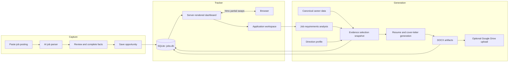

# Job Application Tracker

A local-first, server-rendered job pipeline built with Bun, HonoX, htmx, Drizzle ORM, SQLite, Tailwind CSS, and daisyUI. It has no client-side React or Preact hydration runtime.

## Data flow



## Career data setup

The repository ships with `career-data.example/` and `profiles.example/`: a small, valid dataset that lets a fresh clone start and run tests. To generate your own documents, initialize the runtime directories from those examples and replace the placeholders with accurate, interview-defensible facts:

```sh
cp -R career-data.example career-data
cp -R profiles.example profiles
```

Keep stable IDs when editing. Profiles select and order facts by ID; they should not duplicate the underlying experience, achievement, project, or skill records. The runtime uses `career-data/` and `profiles/` when present, and falls back to the examples otherwise.

For a deployed Fly instance, persist these directories on the mounted `/data` volume, then set `CAREER_DATA_DIR=/data/career-data` and `CAREER_PROFILES_DIR=/data/profiles`.

## Run locally

```sh
bun install
bun run setup     # runs migrations, then synchronizes career-data skills
bun run dev
```

`bun run setup` is equivalent to `bun run db:migrate && bun run skills:sync --apply`. You can also run `bun run db:migrate` alone and skip the career skill sync until your `career-data/` is mounted.

The SQLite database is created as `jobs.db`. Set `DB_FILE_NAME` to use a different file.

## Career skill taxonomy and sync

`career-data/skills.json` is the source of truth for the skills you actually possess. The SQLite `skills` table is an operational taxonomy that also stores skills discovered in job descriptions. Synchronization is one-way and idempotent; the application never writes back to career data.

```sh
bun run skills:audit        # read-only review of duplicates, aliases, and non-skills
bun run skills:sync         # dry-run preview (default)
bun run skills:sync --apply # write inside a transaction
bun run skills:sync --check # non-zero exit when conflicts require manual review
```

- Each career skill must declare one of the eleven canonical `category` IDs and may list `aliases` (alternative spellings resolved deterministically, never fuzzy-matched).
- Sync matches by `career_skill_id` first, then by a unique normalized id, label, or alias. It links unambiguous pending skills, creates new approved skills, and reports conflicts without performing semantic merges.
- Evidence, levels, last-used dates, review notes, and directions are never copied into the taxonomy tables.
- A missing optional `career-data/` directory can be skipped during startup with `bun run skills:sync --if-present`.

## Career data and document generation

`career-data/` is the canonical, factual source used to generate documents. Keep stable IDs in those files: profiles refer to the IDs rather than copying experience or skill details.

- `candidate.json`, `experiences.json`, `achievements.json`, `publications.json`, `projects.json`, `skills.json`, and `stories.json` hold reusable facts. Publications keep a display-ready citation and structured authors, including an `isCandidate` marker.
- `preferences.json` and `portfolio-content.json` remain canonical planning data.
- `profiles/<direction>.profile.json` contains only direction-specific selection and ordering rules. Its `id` must match its filename.

Every generation run records an immutable evidence-selection snapshot in the database and writes a matching JSON file beneath `ARTIFACTS_DIR/run-<id>/`. The workspace’s **Evidence selection & generation record** section shows the exact selected IDs and schema/prompt versions, and lets you download that snapshot. This makes a generated resume or letter reviewable even after career data changes.

Do not use the old `profiles/candidate.profile.json`, `CANDIDATE_PROFILE_FILE`, or `CANDIDATE_PROFILE_JSON` configuration: candidate facts now come only from `career-data/candidate.json`.

For Fly.io deployment, `fly.toml` mounts a persistent volume at `/data` and sets `DB_FILE_NAME=/data/jobs.db`. The machine is configured to stop when idle and start automatically on the next HTTP request. Create the volume once before deploying:

```sh
fly volumes create data --region yyz --size 1
fly deploy
```

Set `ARTIFACTS_DIR=/data/artifacts` and `QUEUE_FILE_NAME=/data/bunqueue.db` in Fly as well, so snapshots, generated documents, and queued work survive machine restarts.

The production start command runs Drizzle migrations before starting the server. Keep one Fly machine for this SQLite deployment because Fly volumes are attached to a single machine.

Fly production reads career data from its persistent volume through `CAREER_DATA_DIR=/data/career-data` (and `CAREER_PROFILES_DIR=/data/profiles`). Synchronize that mounted data into the taxonomy before or after migrations without copying it into the image or Git:

```sh
fly ssh console
cd /app
bun run skills:sync --apply
```

Use `bun run skills:sync --if-present` in startup scripts when career data may not be mounted yet; it exits cleanly instead of raising a runtime error, and startup never writes to the Git-tracked example data.

## How to use the tracker

1. In **Applications**, paste a posting and use **Parse with AI**, or enter the known facts directly in Quick collect.
2. Review the draft. Add the job URL, source, company, and direction yourself, then save it as **Saved**.
3. Move a role to **Apply Today** when it becomes a task. Complete the application workspace and select **Sent application** after applying.
4. Record follow-ups and interviews in the workspace. These activities advance the visible pipeline without overwriting a more advanced status.
5. Generate a resume and cover letter only after configuring OpenAI and career data. Review the evidence snapshot and generated files before using them.
6. Manage reusable companies, contacts, and skills from their dedicated pages under Career and Network. Export JSON periodically as a backup.

### Configuration

Copy `.env.example` to `.env` for local development. `OPENAI_API_KEY` is needed only for AI parsing and document generation. Google OAuth variables are needed only for optional Drive uploads. `CAREER_DATA_DIR` and `CAREER_PROFILES_DIR` optionally point to the runtime fact directories; local defaults are `career-data` and `profiles`.

### GitHub Actions deployment

The workflow in `.github/workflows/ci-cd.yml` runs formatting, typechecking, tests, and a production build for pull requests and pushes to `main`. It does not deploy automatically. To deploy, open **Actions**, select **CI and Fly Deploy**, choose **Run workflow** from `main`, and run it after CI passes. Add a repository secret named `FLY_API_TOKEN` before the first manual deployment.

### VS Code Remote / WSL

The dev server listens on all interfaces at port `5173`. If `http://localhost:5173` is not reachable from your browser, open the VS Code **Ports** panel and forward port `5173`; VS Code will provide the correct localhost URL. You can also use the Network URL printed by Vite (for example, `http://172.17.x.x:5173/`).

## Skill review, scores, and generation readiness

- A parsed job post produces structured skill requirements, each with a canonical name, category, importance, source excerpt, and confidence.
- Requirements resolve against the SQLite taxonomy: proven matches reuse career skills; unknown concepts become pending skills only when the opportunity is saved.
- The application workspace has a **Review** tab. Every `not-in-career-data` skill must be skipped or included with a reason before document generation is enabled.
- Dual scores are shown: **canonical match** (proven matches only) and **application coverage** (proven matches plus user-confirmed includes). Skipped and pending requirements count as uncovered.
- An include is application-only: it never changes career data or the canonical score, and its mandatory reason is the only allowed claim in generated documents.

## Resource pages

Skills, Companies, and Contacts are separate bookmarkable pages under the Career and Network navigation sections. The old `/manage` URL redirects to `/skills`.

- `/skills` — review, approve, reject, recategorize, alias, and merge skills.
- `/companies` — search companies, open websites, and merge duplicates.
- `/contacts` — manage contacts independently while they remain available in application workspaces.

## Backup and migration

Back up `jobs.db` before applying migrations or running `skills:sync --apply` in production. See `docs/migrations.md` for the migration, backup, and restore checklist. After restoring a backup, re-run `bun run skills:sync --apply` to re-link career mappings.

## Useful commands

```sh
bun run typecheck
bun test
bun run build
bun run db:generate
bun run db:studio
```

All UI components are rendered on the server with `hono/jsx`. htmx performs fragment swaps; no React or Preact hydration runtime is used.
